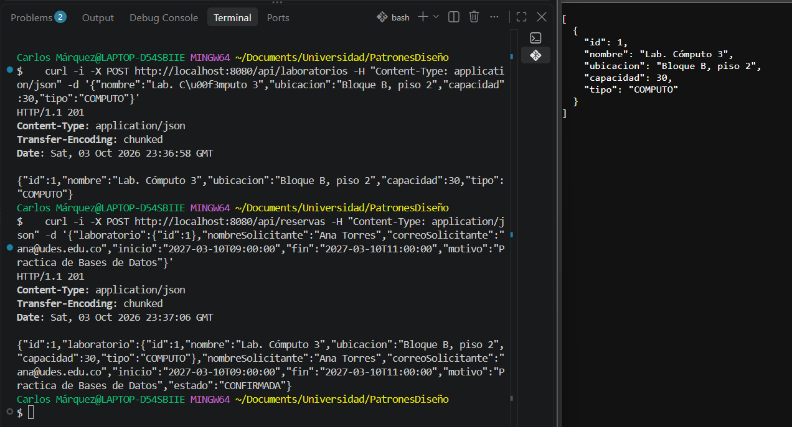
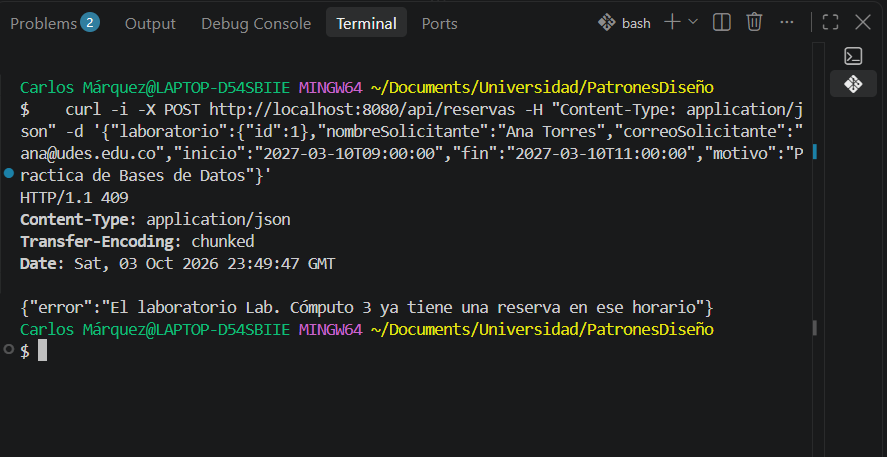
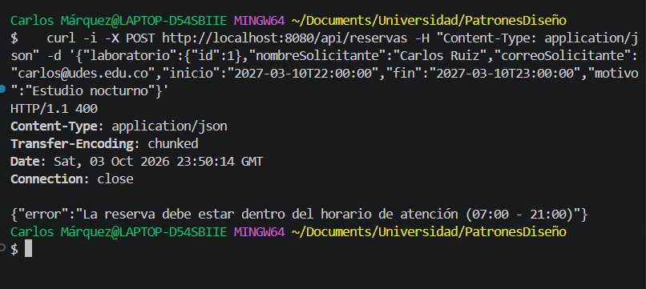
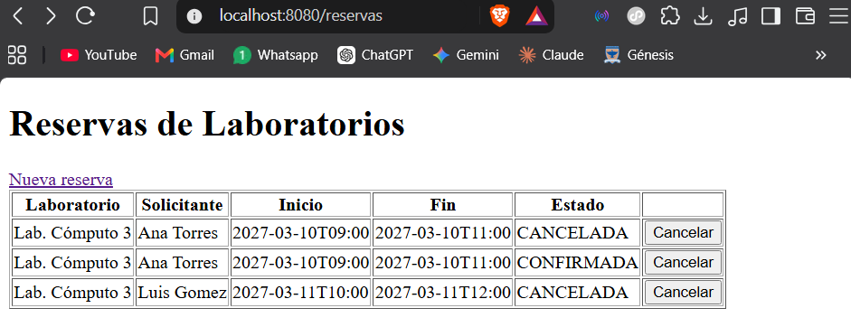
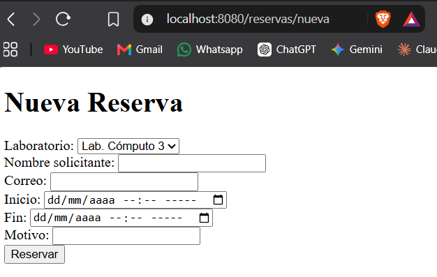
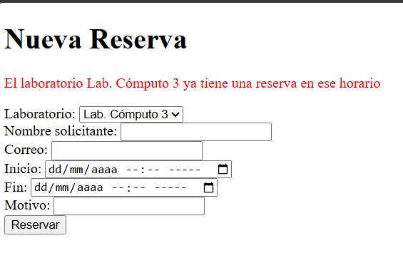

# Post-contenido — Unidad 5: Integración en Aplicaciones Web

## Descripción
Repositorio del post-contenido de la Unidad 5 de Patrones de Diseño
de Software. Un único proyecto Spring Boot (reservas-labs-api) para
la reserva de laboratorios de cómputo, con dos partes: una API REST
en capas (Entity, Repository, Service, Controller) sobre H2, y una
vista Thymeleaf (MVC clásico) que reutiliza el mismo Service.

## Parte 1 — Repository, Service y Controller REST
LaboratorioRepository y ReservaRepository extienden JpaRepository;
ReservaRepository agrega una consulta JPQL propia para detectar
solapamientos de horario. ReservaService concentra las reglas de
negocio (solapamiento, horario de atención, duración, cancelación
tardía). ReservaController y LaboratorioController exponen
/api/reservas y /api/laboratorios. Ver paquetes model/, repository/,
service/, exception/ y controller/.

## Parte 2 — Vista MVC con Thymeleaf
ReservaWebController expone /reservas con Thymeleaf, inyectando la
MISMA instancia de ReservaService que usa la API REST — sin Service
duplicado. ReservaWebExceptionHandler maneja las mismas excepciones
de dominio que GlobalRestExceptionHandler, con presentación distinta
(redirección con mensaje en vez de JSON). Ver paquete web/ y
templates/reservas/.

## Cómo ejecutar
```
$ mvn clean package
$ mvn spring-boot:run
```
API REST: http://localhost:8080/api/reservas

Vista MVC: http://localhost:8080/reservas

## Decisiones de diseño

### Punto de decisión 1 — Ubicación de la validación de solapamiento
La búsqueda de las reservas que se cruzan la hace el Repository con la
consulta JPQL `buscarSolapamientos`. Así el filtro lo resuelve la base
de datos y no hay que traer a memoria todas las reservas del
laboratorio, que van creciendo con el tiempo. La decisión de rechazar
la reserva la toma solo `ReservaService.crear`: si la consulta devuelve
alguna reserva, lanza `ReservaConflictException` con el mensaje para el
usuario. El Repository responde qué reservas se solapan y el Service
decide si se permite crear la reserva.

La alternativa era traer todas las reservas con `findByLaboratorioId` y
comparar los rangos en Java. Se descartó porque cada reserva nueva
tardaría más a medida que el laboratorio acumula historial.

Si el Controller llamara directamente a `buscarSolapamientos()`, la
regla quedaría en la capa HTTP y habría que repetirla en cada
controlador que cree reservas (por ejemplo el controlador MVC de la
Parte 2), con el riesgo de que uno valide y otro no.

### Punto de decisión 2 — Reglas con y sin apoyo del Repository
El horario de atención (07:00 a 21:00) y la duración (30 minutos a 3
horas) solo dependen del inicio y el fin de la reserva que se está
creando, no de otras filas de la base de datos. Por eso
`validarHorarioYDuracion` está completa en el Service, en Java, y no
usa el Repository. El criterio fue: si la regla necesita compararse con
datos que solo conoce la base de datos (las otras reservas), se apoya
en una consulta del Repository; si solo depende del propio objeto, se
queda en el Service.

Para estas reglas se lanza `ReservaInvalidaException`, que se responde
con 400 porque el error está en los datos enviados. El solapamiento se
responde con 409 porque es un conflicto con una reserva que ya existe.

`LaboratorioController` es la única excepción a que el Controller no
use el Repository: el catálogo de laboratorios es un CRUD sin reglas de
negocio, y un `LaboratorioService` que solo delegara sería un Service
anémico. La capa Service se agrega cuando hay una regla que la
justifique.

### Punto de decisión 3 — Cómo comparten Service el Controller MVC y el REST
`ReservaController` (REST) y `ReservaWebController` (MVC) reciben por
constructor la misma clase `ReservaService`, que Spring maneja como un
solo bean:

- `ReservaController.java`, línea 16: `public ReservaController(ReservaService service)`
- `ReservaWebController.java`, línea 18: `public ReservaWebController(ReservaService service, LaboratorioRepository laboratorioRepo)`

Ninguno de los dos valida el solapamiento ni el horario; los dos llaman
a `service.crear(...)` y `service.cancelar(...)`. Si se hubiera copiado
la validación en el controlador web, o creado un segundo
`ReservaWebService`, cualquier cambio en la regla habría que hacerlo en
dos lugares y con el tiempo la web y la API terminarían aceptando
reservas distintas.

### Punto de decisión 4 — Manejo de errores consistente entre MVC y REST
Se usan dos manejadores. `GlobalRestExceptionHandler`
(`@RestControllerAdvice(annotations = RestController.class)`) responde
JSON con el código 404, 409 o 400. `ReservaWebExceptionHandler`
(`@ControllerAdvice(assignableTypes = ReservaWebController.class)`)
redirige al formulario o a la lista con el mensaje de error.

Un solo `@RestControllerAdvice` no servía porque siempre responde JSON
y la página necesita una redirección con un mensaje. Un único manejador
que revisara el header Accept tendría una condición por cada excepción.
Los dos manejadores reciben las mismas excepciones que lanza el Service
(`ReservaConflictException`, `ReservaInvalidaException` y
`RecursoNoEncontradoException`), así que el mensaje de solapamiento es
el mismo en la API y en la página; solo cambia la forma de mostrarlo.

## Capturas de pantalla
Reserva creada desde la API (201):



Reserva solapada en la API (409):



Reserva fuera del horario de atención (400):



Página /reservas:



Página /reservas/nueva:



Reserva solapada desde el formulario (mismo mensaje que la API):



## Herramientas utilizadas
- Java 17, Spring Boot 3.2, Spring Data JPA, H2, Thymeleaf
- Apache Maven, Postman/curl, Git, GitHub

## Conclusiones
Lo más difícil fue decidir dónde va cada regla. El solapamiento
necesita datos de otras reservas, así que la consulta quedó en el
Repository y la decisión en el Service, mientras que el horario y la
duración se validan solo en el Service porque no necesitan la base de
datos. Tener las reglas en ReservaService permitió agregar la vista
Thymeleaf sin repetir ninguna validación: el controlador MVC solo
cambia cómo se muestran los resultados y los errores. También aprendí
que no hace falta un Service para todo, como en el catálogo de
laboratorios, que no tiene reglas de negocio.
